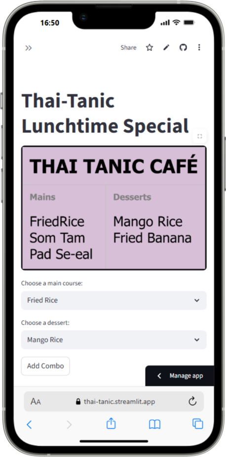

# Thai Tanic Lunchtime Special

### Purpose:
This app helps students understand combinations in a fun and interactive way. By choosing one main course and one dessert, students explore how many unique meal combos can be created. The app tracks their selections and celebrates when all combinations are chosen.

[](https://thai-tanic.streamlit.app/)



### Key Features:
- **Combination Exploration**: Choose from 3 main courses and 2 desserts to create unique meal combos.
- **Progress Tracker**: The app keeps a record of selected combos, ensuring no combo is repeated.
- **Completion Celebration**: Once all possible combos are selected, the app shows a fun success message and balloons.
- **QR Code for Practice on Mobile**: A QR code is generated, allowing students to scan and access the interactive combo practice on their mobile devices.

### Based On:
This app is based on a combinatorics [activity](https://www.transum.org/Maths/Exercise/Listing/Default.asp?Level=3) from [Transum.org](https://www.transum.org/), where students are asked to determine how many different meal combinations are possible from a menu with 3 main courses and 2 desserts.

---

### How to run it on your own machine

1. Make sure you have Python 3.9+ installed.
2. Install the requirements

   ```
   $ pip install -r requirements.txt
   ```

3. Place the image (`thai-tanic.png`) in the same directory.
4. Run the app

   ```
   $ streamlit run streamlit_app.py
   ```

---

### Customization

- **Modify Menu Options**: Edit the mains and desserts lists in the code to change the available items.

- **Change QR Code**: Update the QR code link (qr_link) to reflect the correct URL if the app is hosted elsewhere.

- **Replace Image**: Update the image file path (`thai-tanic.png`) to change the image displayed in the app.
